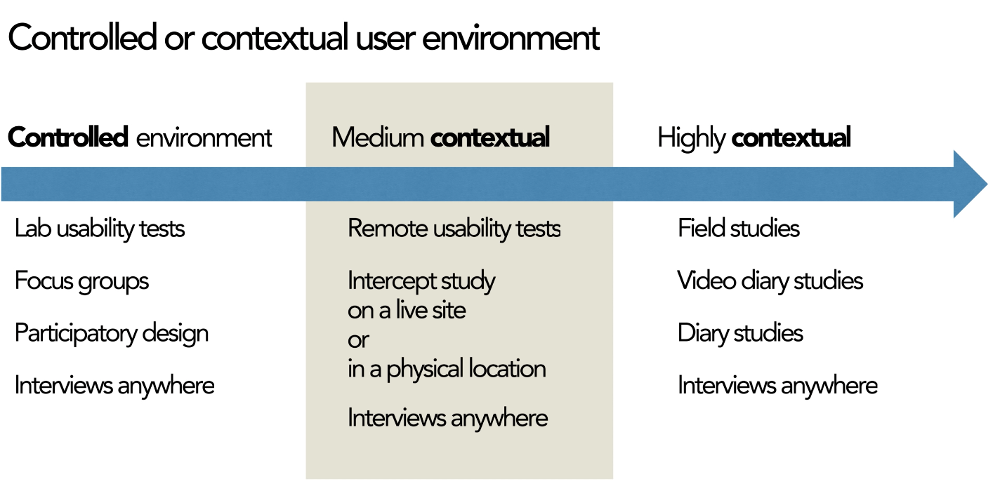

<head>

</head>

# Notes on UX Research Methods &amp; Usability Testing (Nielson Norman Group)

The original YouTube playlist can be found [here](https://www.youtube.com/playlist?list=PLJOFJ3Ok_idtiMTz8fAiF1ElcKJM7Rncj)

**Disclaimer:** The following content is neither sponsored nor endorsed by the [Nielson Norman Group](http://nngroup.com/). Rather [TheRisingTilde](https://medium.com/the-rising-tilde) has provided these notes as an educational resource to be accompanied with the original playlist. 

## User Testing

- You (the software engineer or the business) are never the user → you know too much.
- Cheap → can be done in a few days with just five users.
- How to do user testing:
  - Get representative users
  - Get users to perform realistic tasks - they need to try and accomplish something with the intended design.
  - Shut up and let the users do the testing

## Discovery: Common misconceptions

- Not a synonym for user research: learning about all aspects of a problem to understand it and frame it appropriately
- Discovery needs user research: If no research, you might end up stating what you already know or think you already know.
- Discovery is not a one-person job: Can&#39;t always work on technology and business requirements while user research is still in progress. This way, only one person understands the problem space.
- Not a validation exercise: Discovery is to learn something you don&#39;t know. Don&#39;t validate solutions via users.
- Discovery is not a design sprint: Workshopping and ideating is not a discovery. Also, the goal of discovery is not to produce a high fidelity prototype.
- A real discovery:
  - Involves user research
  - Explores available technologies
  - Defines the problems to be solved
  - Uncovers successful outcomes
  - Involves a multidisciplinary team
  - A mindset that we don&#39;t know all the answers

## Remote moderated usability testing.

- User unmoderated testing:
  - Give users tasks and wait for data to be collected.
  - Faster, easier, and cheaper than in-person testing
  - The testing tool does the job of the facilitator - administers tasks to a user.
  - But does not capture reactions, nor can we ask probing questions.
- User moderated testing uses a facilitator to run the session:
  - Higher quality and more detailed testing

## Formative vs. Summative Usability Evaluation

- Formative: Tells you what aspects of your design work and don&#39;t work and tells you why
  - Heuristic reviews, cognitive walkthrough, usability testing
  - The goal is to understand what precisely is working and not working, and why?
  - Used frequently to support iterations through the design process:

  - Use early on in the design process
- Summative: Tells you overall how your design works - compared to your competitors and benchmark
  - Carried out when you have a complete design or a shipped product
  - Customers use systems without assistance and grade it
  - Metrics, e.g., Satisfaction, ease of use, net promoter score
  - How usable or satisfying your UX is
  - It tells you how iterations compare to each other
  - Need a large representative sample
  - Isn&#39;t helpful if you want to evaluate your product quickly

## 5 Steps for Effective Diary Studies in Customer Journey Research

1. Planning and preparation
  - Recruit customers to record their experiences.
2. Pre-study brief - explain to customers what type of data you need.
3. Logging period - monitor insights as they come in to fully understand the context of their experience
4. Post-study interview
5. Analyze findings - look for points of friction, find opportunities to improve
  - This helps finds contextual information about the consumer journey.

## Usability Testing with Five users

- Not going to learn much more with subsequent users.
- But there are some types of research like quantitative usability studies:
  - Where the goal is to drive metrics
  - Need large n to get a good statistical significance
- Find the number of users based on the best ROI:
  - How good you are at deriving insights and design recommendations from observations of user behavior.
    - in a situation where it&#39;s relatively easy to understand what the user is doing - can get away with a smaller number of users
  - How efficient is your team at taking in these recommendations and designing a new product to work on
    - If in a slow-moving organization, then you need to be certain with your insights → a larger number of users
    - A fast-moving team (with paper prototypes, etc.) can do with fewer users.
  - Aim to keep getting test users until some form of generalization/repeated behavior is observed among users → no new/limited insights
- Information foraging: &quot;hunt&quot; for more insightful feedback once you&#39;re done with one iteration of feedback (for a prototype)
  - Leads to the discovery of new and exciting problems with contemporary designs

## UX Research Cheat Sheet

- Discovery: Validate and discard assumptions
  - Field studies
  - Diary studies
  - User Interviews
  - Stakeholder interviews
  - Constraint inventory
- Explore: Understand the user space and how you can satisfy your user&#39;s needs
  - Competitive Analysis
  - Persona Building
  - Journey Mapping
  - Design reviews
  - Task analysis
  - Card sorting
- Testing: Make sure the systems we design work well for the user
  - Qualitative testing
  - Benchmark testing
  - Accessibility evaluation
- Listening:
  - Surveys
  - Analytics Reviews
  - Search log reviews
  - Usability bug reviews
  - FAQ reviews

## How to Test Visual Design

- Assess both opinion and behavior
- Comparing multiple versions of the design to increase the test&#39;s sensitivity and makes it easier to understand the differences and what caused them.
  - A/B test
  - Usability testing

## User Testing Facilitation Techniques

- Echo: Clarify what the users meant if he/she says something incoherent or unclear
- Boomerang: If users ask a direct question, deflect it back to them - this avoids assisting the user too much
- Columbo: Ask partial questions, e.g., &quot;You swiped here…&quot;

## Pillars of usability testing

1. Typical users:
  - Recruit people similar to your target users
  - Exclude those who aren&#39;t a good fit. E.g., users that have something against your brand.
2. Appropriate tasks
  - Set the stage for how they&#39;re going to navigate through the interface
  - Match tasks to research goals
  - Don&#39;t give too many details.
  - Write user-centered tasks without telling them how to accomplish them and without giving cues about the interface.
  - Add a brief context
3. Skilled facilitator
  - Stays out of the user&#39;s way
  - Doesn&#39;t bias the user&#39;s way of thinking.
  - Only probes to get a user to articulate further
  - Talks minimal
  - Make sure that the user is feeling comfortable.
  - Capacity to analyze and interpret results

## Open vs. Closed Questions in User Research

- Closed-ended
  - Good for quantitative research
  - Gives us metrics and scale
- Open-ended
  - Accepts a variety of answers
  - difficult to quantify
  - Great for exploratory studies
  - Gives us new and detailed insights

## A/B Testing vs. Multivariate Testing for Design Optimization

- Multivariate testing:
  - Split live traffic to different design variations to test their impact
  - Measure conversions
  - But every new combination = new variation to test
  - Multi-variate testing = usually better to refine a testing page.

## Between-Subject vs. Within-Subject Study Design in User Research

- Between-subjects study design: different people test each condition to only be exposed to a single user interface. (e.g., rent a car only on Hertz)
- Within-subjects study design: the same person tests all the conditions (i.e., all the user interfaces). (e.g., all subjects rent a car on Hertz and Alamo)

## Thematic Analysis of Qualitative User Research Data

- Identify common themes among participant data.
- g. Group responses from interviews into themes

## Analytics vs. Quantitative Usability Testing

- Analytics:
  - Seeing what your users do in the wild
  - g., google analytics
  - inexpensive
- Quantitative:
  - Experimental
  - Can control conditions
  - Expensive
  - Get a richer picture of the usability of the website

## Eyetracking Shows How Task Scenarios Influence Where People Look

- Users choose what to read based on patterns they&#39;ve seen.
- Make page layout predictable and consistent.

## Open vs. Closed Card Sorting

- Get insight into how users expect content to be organized on a website.
- Use open card sorting to learn how users group content and the terms or labels they give each category.
- Closed Card Sort:
  - Participants are asked to sort topics from content within your website into pre-defined categories.
  - People need to understand what they&#39;re going to get entirely based on labels

## Turning Analytics Findings Into Usability Studies

- Analytics data only tells you what behaviors are occurring on your site or app
- Why users are confused = need qualitative data
- Replicate your tasks as closely as possible to reflect the analytics data
- E.g., based on analytics users starting an interaction flow but fail to finish it → convert this into a task for a usability study

## When to Use Which UX Research Method

- Watch users do things - observed by researches → behavioral study
  - Test whether the design process is:
    - Discoverable
    - Findable
    - Understandable
    - Usable

  - Tempting to ask user directly what they think during the prototyping phase → try and avoid this
  - Instead, direct the user to try and do something
- Ask users questions - self-reported by users → attitudinal study
  - Interested in what people have to say - whether they&#39;ll like to dislike something
  - Self-reported methods can be used:
    - Interviews
    - Surveys
    - Focus groups

- Quantitative: metrics and numbers
  - Answers &quot;How many&quot; and &quot;How much&quot;
  - Goals include:
    - Determine priority or scale of the problem
    - Compare alternative design options
    - Benchmark user services
  - Compute expected cost savings from design changes
  - g.
    - Cart sorting
    - Tree testing
    - Eyetracking heatmaps
    - Quantitative usability tests
- Qualitative: stories, events, and examples
  - Answers &quot;What&quot; and &quot;Why&quot;
  - Goals include:
    - Discovery problems
    - Investigate why
    - Learn how to fix
  - Used in very early prototypes usability tests
  - g.
    - Field studies
    - Diary studies
- Controlled or contextual user environment

## How to avoid bias in card sorting

- Choose a sample of content for sorting.
- Remember the content and size of the samples impact the groupings the customers will make.
  - g. broccoli, apples, scones, and muffins would be split into two categories - produce and baked goods
  - g. broccoli, apples, scones, banana, carrots, and muffins would be split into two new categories - fruits and vegetables and baked goods
- The more items you include, the more likely people are to make a new standalone category.
- Ensure cards that proportionally represent your content - but keep in mind these are based on your preconceived notion of what a card sort is
- Pilot test your card sort
- Good idea to follow up card sort with tree test → ask users to use the categories you selected to find content on your site.

## How to Maximize User Research Insight (Jakob Nielsen keynote)

- Reliability: the probability of getting the same number if running the same test twice
- Validity: Do findings translate into the real world?
  - If we make a business decision with this result, is it going to make us more money?
- Studies in UX might be stale.
- Diversification in research:
  - Different demographics, behavioral → different personas
  - Study diversity → Test different designs, tasks, and methods
  - Use different testing methods.

## Contextual Inquiry: Leave Your Office to Find Design Ideas

- semi-structured interview method to obtain information about the context of use, where users are first asked a set of standard questions and then observed and questioned while they work in their own environments.
- Early stages - helps see things you won&#39;t anticipate
- Helps shapings things like requirements, personas, user flows, architecture, and content strategies
- Provides insights for new features
- Find illogical processes

## How Can We Study Website Credibility? (Katie Sherwin)

- Observe users rather than ask them whether the site is credible
- Asking questions influencers their answers and/or behavior (while doing the tasks)
- Look for signs where they question information on the site.

## 4 Steps to Field Studies with Users

- In Situ: in the natural or original position or place
  - Gain real insights
  - See social situations to see how to fit products and services into users&#39; daily lives.

1. Screen for participants
2. Schedule participants - try and not tell them what you&#39;re looking for (as this can influence their behavior)
3. Plan your setup
4. Conduct the visit

## User Testing with Sensitive Data

- Hide sensitive/mask data
- Provide company credit card instead of making them use their own
- Make clear the purpose of the session and the type of information that will be collected.
- Steps to use protect their privacy
- Follow through with the data retention policy.
- Take notes if a recording isn&#39;t possible.
- Take screenshots and redact personal information.

## The 3 Types of User Interviews: Structured, Semi-Structured, and Unstructured

- Structured:
  - Carefully scripted questions
  - Lots of closed questions with predetermined options
  - Do not probe the user with questions.
  - Not used in the early stages of the project.
  - Used when interviewing a lot of people and want to compare responses
- Semi-Structured:
  - Few questions prepared
  - also known as open-ended guide
  - Generally open-ended questions
  - Will ask probing questions
  - Can change the ordering of questions as well - depending on insights user is generating
  - Looking for answers about specific areas
- Unstructured
  - No questions prepared
  - Instead have a list of topics to cover
  - Conducted when we know nothing about the domain
  - But hard to think of good non-leading questions on the spot

## 5 Qualitative Research Methods

- User interviews
  - One-one conversions
  - Learn first-hand stories
  - Structured, semi-structured, unstructured
  - In-person or over the phone
- Field Studies
  - Takes place in the user&#39;s context
  - (A) Direct observation
    - Used to understand user vocabulary
    - Used to better understand what users do
    - Discover common workarounds
  - (B) Contextual inquiry
    - Semi-structured
    - Ask a standard set of questions, then observe the user and ask questions while the user performs processes
- Diary study
  - Longitudinal method
  - Collect:
    - Habitual Usage - primary tasks and routines
    - Change in attitude - brand perception and loyalty
- Focus groups
  - Users come together to understand issues and concerns

## Survey Response Biases in User Research

- Acquiescence Bias
  - A tendency to agree or say yes
- Social desirability bias
  - The tendency to overreport socially desirable behavior
  - And underreport socially undesirable behavior and characteristics.
- Recency bias
  - Respondents will give more weight to recent experiences.
- Surveys measure user perception and not objective performance.
- Response bias Is why we need a large sample size - cancel out random variations.

## Tree Testing to Evaluate Information Architecture Categories

- Give participants menu structures and give them tasks to find specific information.
- Can also test structure of a competitor
- Trying to find what % of users were able to find the content they were looking for

## Incentives for Participants in UX Research

- Monetary:
  - usually meant for research conducted on the weekdays
  - These users have taken time off their work to take up this interview
  - Considerations:
    - Job category
    - Study location
    - Session length
    - Task complexity
- But don&#39;t overemphasize incentive when looking for people - will lead people to exaggerate their qualifications
- Non-monetary
  - Usually for internal employees

## Running a Remote Usability Test

- Send out day-of reminders:
  - Time
  - Equipment
  - App installed
  - How to join
  - Good wifi
  - Quiet place
- Bring in observers and participants.
- Introduce the session:
  - Welcome and thanks
  - Confirm the name pronunciation
  - Mention observers
  - Collect consent
  - Tell them you&#39;re starting the recording.
  - Ask them to share their screen.
- Optional: Short interview
  - Ask some behavioral questions, e.g., what kind of apps do you use when shopping online.
  - Gives you context about the participant&#39;s experiences and preferences
- Administer tasks
  - Participants should have a written copy.
- Reassure the participant
- Close the session
  - Final questions
  - Thank participant + give the gift
- Discuss and Reflect

## How to Do User Research Within Constraints

- Create a low fidelity artifact instead of high fidelity to avoid unnecessary silos and handoffs
- The time you save = can be spent on research.
- Get your team into research.
- Carve out time in existing meetings to discuss UX research rather than setting up new meetings

## Using usability-test participants multiple times (Kara Pernice)

- Can you use the same persons more than once in a usability study?
  - Usually no, since the person is already aware of the tasks he/she needs to undertake.
  - Post-interview questions and debrief gives them a better understanding of the study itself and no longer makes them a &quot;user.&quot;
  - But can make them design partners.
- How to find new users?
  - Use recruiting agencies
  - Social media
  - Build a database of people
  - Friends and family + ask them to ask their friends and families.

## 5-Second Usability Test

- Show web page to user and then ask them to recall what they&#39;ll see.
- Used to gauge users first responses to a screen or design
- Don&#39;t tell users that you&#39;ll be asking them to recall what they&#39;ll see before you start the test
- Not used for user preferences but only to draw out first impressions and gut reactions.

## Paper Prototyping 101

- Used to get feedback quickly
- Can test:
  - Information architecture
  - Content
  - Structure
  - Task flows
  - Interaction designs
- Should be a collection of screens - one screen per page
- Include a loading indicator
- Under construction page
- Show printed or written list of tasks.
- Use a blank paper to draw out improvements between tests.

## Top Tasks for UX Design: How and Why to Create Them

- Tasks a user should be able to do or else your design has failed.
- Helps maintains balance in research.
- Use as a guide for heuristic evaluation.
- Collect data from previous methods to create tasks
- Can use an open-ended survey to find some top tasks

## Intentional Silence as a Moderation Technique

- In periods of silence, participants often offer poignant information.
- Can break a participants train of thought if a facilitator rushes into the next question
- Use body language to provide space:
  - Maintain eye contact or focus
  - Don&#39;t speak nor nod your head.
  - Wait patiently, relax, and wait for the other person to speak.
- Tricks:
  - Count silently to 7 before speaking
  - Take a sip of water

## Usability Testing with Minors

1. Determine age-appropriate incentives
2. Prepare a variety of tasks
  - make tasks engaging
  - Write more tasks than you think you need as kids tend to focus mainly on completing a task rather than completing it correctly
3. Don&#39;t look or act too authoritative.
  - Remind them that they&#39;re not being tested - no right or wrong answer
  - Respond since kids look for responses - encourages confidence

## Catching Cheaters and Outliers in Remote Unmoderated User Studies

- Cheaters = only interested in getting paid and may not even try to perform the tasks
- Outliers = whose behavior and performance is very different from the rest of your user population
- Qualitative:
  - Watch the recordings
- Quantitive
  - Spot-check the videos
  - Time on task:
    - Check the distribution for times that are too long or too short.
    - Mark this as outliers but don&#39;t throw this data away
    - Investigate further. E.g. if task duration is too short and there are few successes, then this might be a &quot;cheater&quot;
  - Task successes per participant
  - Look at multiple platforms.

## Doing Field Studies Remotely

- Have users take photos of their environment beforehand
- Allow extra time for technical issues.
- Turn off your webcam during the observational part of the study.
- Ask them to think out loud - better to do this during remote (not recommended in-person)
- Observe for environmental cues.
- Keep sessions shorts and try follow-ups.